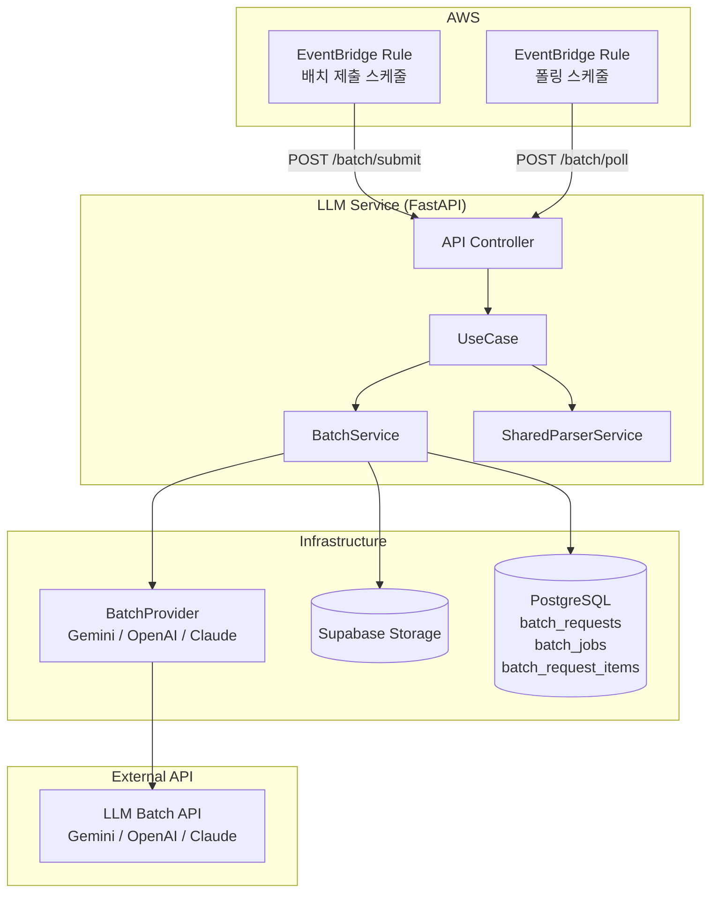
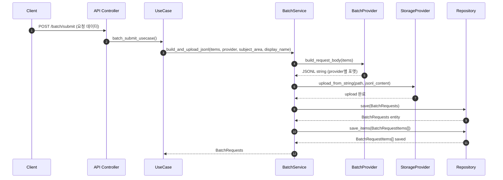
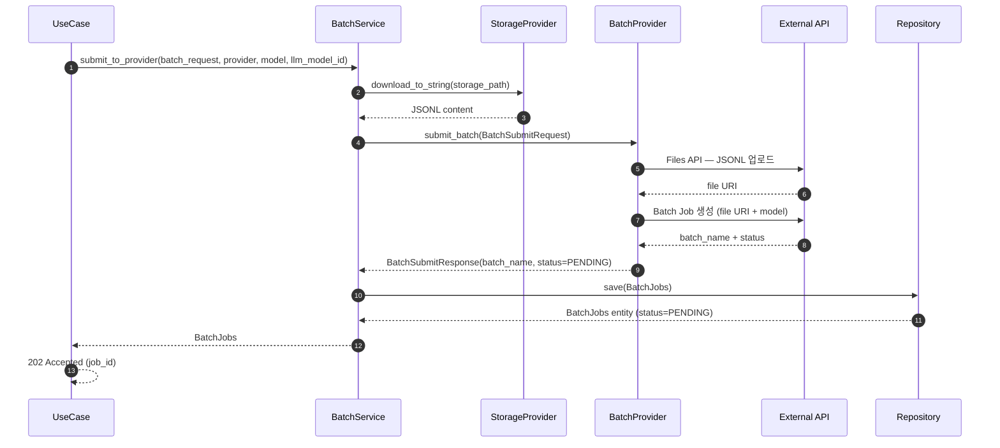
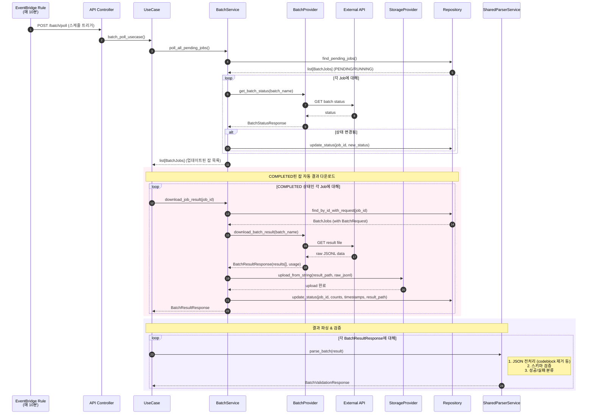
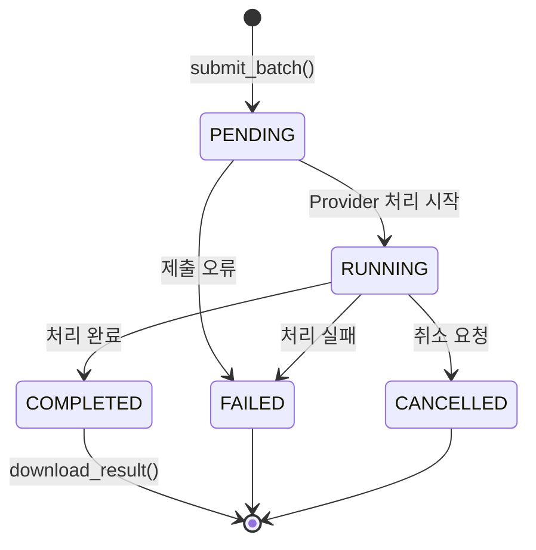
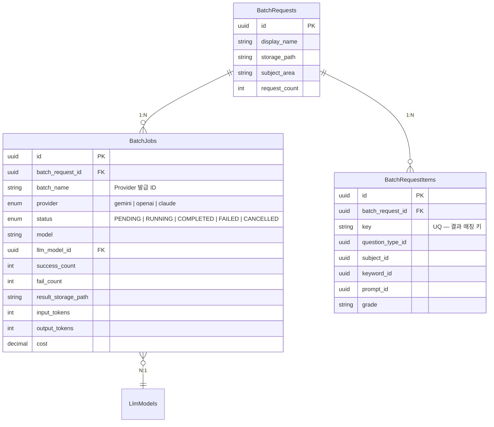

# Batch Processing - Sequence Diagram

## 전체 아키텍처 개요

## Phase 1 — JSONL 빌드 & 업로드

배치 요청 데이터를 Provider별 JSONL 포맷으로 변환하고 Storage에 업로드.

## Phase 2 — Provider에 배치 제출

Storage에서 JSONL을 다운로드하여 Provider API에 제출하고, BatchJob 레코드 생성.

## Phase 3 — 상태 폴링 & 결과 다운로드

EventBridge가 주기적으로 트리거. PENDING/RUNNING 잡 상태 확인 후, COMPLETED된 잡은 자동으로 결과 다운로드.

## EventBridge 스케줄 구성

| Rule | 스케줄 | 대상 | 설명 |
|------|--------|------|------|
| 배치 제출 | `cron(0 2 * * ? *)` | `POST /batch/submit` | 매일 새벽 2시, 문제 생성 배치 제출 |
| 폴링 | `rate(10 minutes)` | `POST /batch/poll` | PENDING/RUNNING 잡 상태 확인 + COMPLETED 결과 다운로드 |

- 스케줄 변경은 EventBridge Rule 수정으로 처리 (DB 설정 불필요)
- Rule enable/disable로 스케줄러 on/off 제어
- 폴링 Rule은 PENDING 잡이 없으면 조기 리턴 (불필요한 비용 없음)

## 상태 전이 다이어그램

### Provider별 상태 매핑 (Gemini)

| Gemini API | Internal Status |
|------------|-----------------|
| `JOB_STATE_PENDING` | PENDING |
| `JOB_STATE_RUNNING` | RUNNING |
| `JOB_STATE_SUCCEEDED` | COMPLETED |
| `JOB_STATE_FAILED` | FAILED |
| `JOB_STATE_CANCELLED` | FAILED |
| `JOB_STATE_EXPIRED` | FAILED |

## DB 테이블 관계

